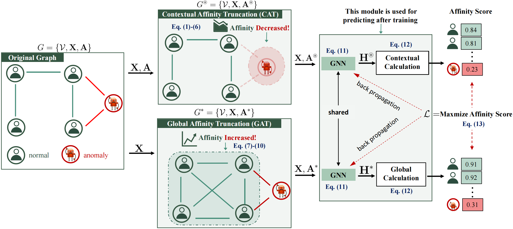

# GCTAM: Global and Contextual Truncated Affinity Combined Maximization Model For Unsupervised Graph Anomaly Detection

This repository is the source codes implementation of  "GCTAM: Global and Contextual Truncated Affinity Combined
Maximization Model For Unsupervised Graph Anomaly Detection"

# Overview


# running environment
* python 3.10.15
* torch 1.13.1+cu117
* dgl 1.0.1+cu117
* torch_geometric 2.3.1
* networkx 2.6.3
* scikit-learn 1.0.2
* scipy 1.9.0

# Data
* The first step is to get the dataset from the following link.

* https://drive.google.com/drive/folders/1HP6xRrlDxVDY0HMy7gL7lnIsQ170gc3G?usp=sharing

* The second step is to put it in the /data path.

# Training
```train
python train_GCTAM.py
```

# Dataset

| Dataset | Nodes | Edges      | Attributes         | Anomalies(Rate) |
|--------|-------------|----------|----------------|----------|
| Amazon(UPU)  |10244| 175,608 |25| 693(6.66%)|
| YelpChi (RUR)  |24,741| 49,315| 32| 1,217(4.91%)|
| ACM  |16,484| 71,980| 8,337| 597(3.63%)|
| Facebook  |1,081 | 55,104|  576| 27(2.49%)|
| Reddit  |10,984| 168,016| 64 | 366(3.33%)|
| Amazon-all  |11,944 |4,398,392| 25| 821(6.87%)|
| YelpChi-all |45,941 | 3,846,979 |32 |6,674(14.52%)|

# Results

Our model achieves the following performance on :
| Metric | Amazon | YelpChi | ACM | Facebook | Reddit | Amazon-all | YelpChi-all |
|--------|--------|---------|---------|----------|--------|------------|-------------|
| AUROC | 0.8438 | 0.7900 | 0.9077 | 0.9238 | 0.5921 | 0.8889 | 0.5957 |
| AUPRC | 0.5069 | 0.1604 | 0.5210 | 0.2281 | 0.0417 | 0.6718 | 0.2013 |

# Cite
If you compare with, build on, or use aspects of this work, please cite the following:

```js/java/c#/text
@inproceedings{liu2024arc,
  title={GCTAM: Global and Contextual Truncated Affinity Combined Maximization Model For Unsupervised Graph Anomaly Detection},
  author={Xiong Zhang and Hong Peng and Zhenli He and Cheng Xie and Xin Jin and Hua Jiang},
  booktitle={International Joint Conference on Artificial Intelligence},
  year={2025}
}
```


